# AtmaOS - Personal Cloud Intelligent OS

> A conceptual cloud-based operating system for personal knowledge management and AI-powered task automation

AtmaOS is a vision for a next-generation personal operating system that runs entirely in the cloud, combining AI agents, knowledge management, and task automation into a unified platform accessible through everyday messaging apps.

## 🌟 Vision

AtmaOS reimagines the personal computing experience by:
- **Unifying** scattered digital content into a personal knowledge graph
- **Automating** routine tasks through AI-powered agents
- **Simplifying** interaction through familiar messaging interfaces
- **Connecting** data across platforms into a "Personal Web"

## 🏗️ High-Level Architecture

AtmaOS follows a classical Chinese governmental structure metaphor, where each component has a specific role:

```mermaid
graph TB
    User[User via 内阁辅<br/>Messaging Apps]
    
    User --> Receive[Receive 内阁辅<br/>Command Interface]
    Receive --> Plan[Plan 中书省<br/>LLM Planner]
    Plan --> Review[Review 门下省<br/>Program Reviewer]
    Review --> Execute[Execute 尚书省<br/>Program Executor]
    Execute --> Report[Report 御史台<br/>Result Reporter]
    
    Execute --> Storage[文渊阁<br/>GitHub MCP]
    Execute --> Memory[守藏史<br/>Vespa Semantic]
    Execute --> Cache[笔帖式<br/>Redis Cache]
    Execute --> Scheduler[司天监<br/>n8n Daemon]
    Execute --> Explorer[锦衣卫<br/>Web/File Explorer]
    
    Report --> User
    
    style User fill:#e1f5ff
    style Plan fill:#fff3e0
    style Review fill:#f3e5f5
    style Execute fill:#e8f5e9
    style Report fill:#fce4ec
```

### Core Components

| Component         | Chinese Name | Role                                       | Technology           |
| ----------------- | ------------ | ------------------------------------------ | -------------------- |
| File System       | 文渊阁          | Document storage and version control       | GitHub Repo w/ MCP   |
| Semantic Memory   | 守藏史          | Vector search, clustering, recommendations | Vespa                |
| Cache             | 笔帖式          | High-speed temporary storage               | Redis                |
| Processor         | 中书省          | Planning, reasoning, and interpretation    | Large Language Model |
| Reviewer          | 门下省          | Program analysis and validation            | Analysis Tools       |
| Executor          | 尚书省          | Program runtime execution                  | Runtime Environment  |
| Scheduler         | 司天监          | Cron jobs, webhooks, and daemons           | n8n                  |
| Explorer          | 锦衣卫          | Web crawling and file exploration          | Chrome DevTools MCP  |
| Command Interface | 内阁辅          | User interaction layer                     | Messaging Bots       |
| Reporter          | 御史台          | Result presentation                        | Report Generator     |

## 🚀 Key Features

### Personal Web
- Collect content from across the internet (bookmarks, posts, articles, conversations)
- Build a personalized knowledge graph
- Browse your collected content as an interconnected web
- Render Markdown and HTML files from Memory as interactive UI

### AI-Powered Automation
- Natural language task descriptions
- Automatic task planning and execution
- Multi-step workflows with human-in-the-loop options
- Learning from user preferences and history

### Unified Interface
- Interact through WhatsApp, WeChat, Telegram, or other messaging apps
- Simple commands: save, search, ask, execute
- Share content from any app directly to your AI assistant
- Cloud-based: access from anywhere

### Agent Workflow
AtmaOS uses a **program-as-plan** model where the LLM generates executable programs to accomplish tasks:

1. **Receive**: User sends command via messaging app
2. **Plan**: LLM generates a program (with variables, loops, conditionals, functions)
3. **Review**: Automated analysis checks the program
4. **Execute**: Program runs deterministically, calling MCP tools, LLMs, and stored agents
5. **Report**: Results are formatted and sent back to user
